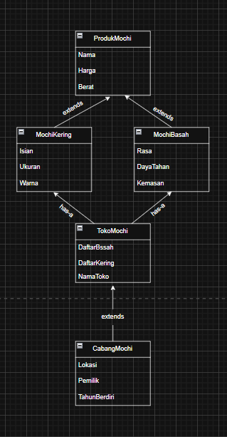
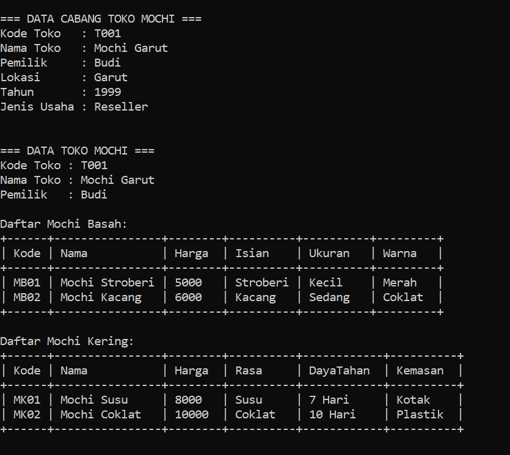
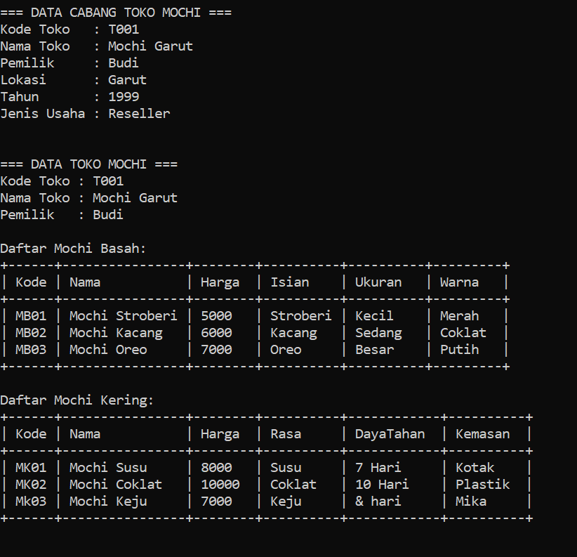
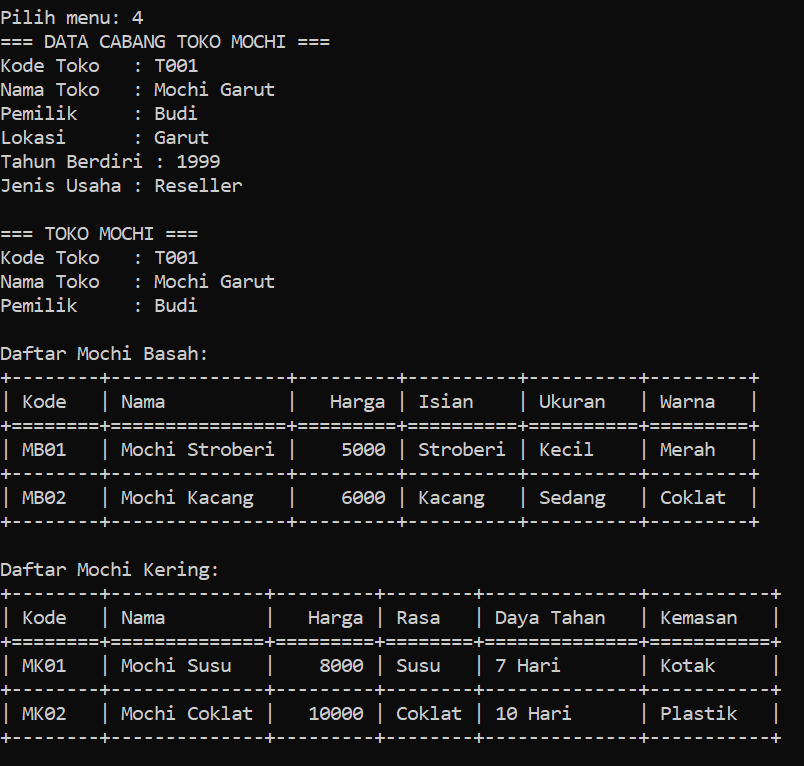
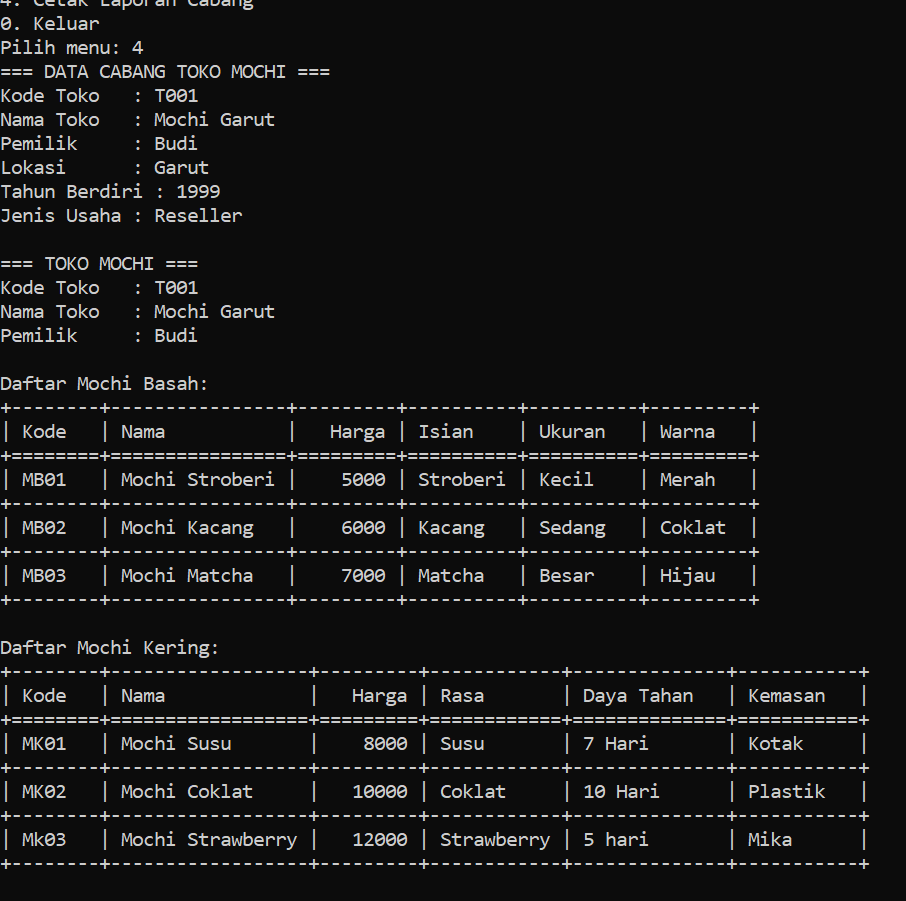
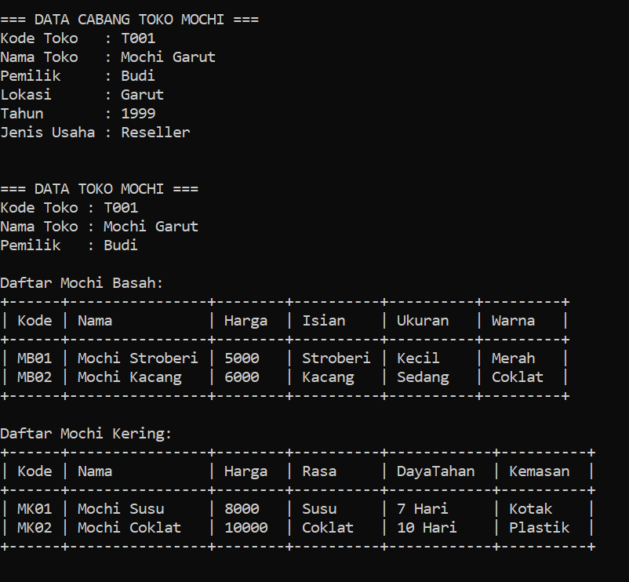
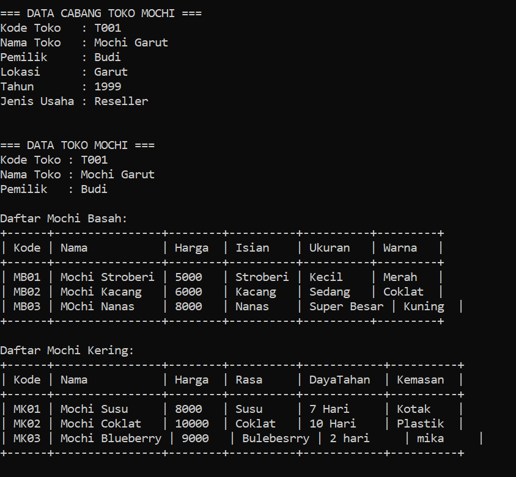

# TP3DPBO2425C2

Saya Niha April Miani dengan NIM 2402567 mengerjakan Tugas Praktikum 3 dalam mata kuliah Desain Pemogramana Berorientasi Objek untuk keberkahanNya maka saya tidak melakukan kecurangan seperti yang telah dispesifikasikan. Aamiin

## Mochi ##

## Diagram ##

## Atribut & Metode ##
- ProdukMochi
Atribut: kode, nama, harga
Methods: konstruktor, getter/setter
- MochiBasah (extends ProdukMochi)
Atribut: isian, ukuran, warna
Methods: konstruktor, cetak data mochi basah
- MochiKering (extends ProdukMochi)
Atribut: rasa, daya_tahan, kemasan
Methods: konstruktor, cetak data mochi kering
- TokoMochi
Atribut: kode_toko, nama_toko, pemilik, mochi_basah[], mochi_kering[]
Methods: tambah_basah(), tambah_kering(), laporan()
- CabangToko (extends TokoMochi)
Atribut: lokasi, tahun, jenis
Methods: override laporan() (menampilkan info cabang + produk)

## Penjelasan Desain Program ##
- Inheritance (pewarisan)
MochiBasah dan MochiKering mewarisi ProdukMochi → karena keduanya adalah jenis produk mochi dengan tambahan atribut spesifik.
CabangToko mewarisi TokoMochi → karena cabang adalah toko dengan informasi tambahan (lokasi, tahun, jenis usaha).

- Composition (has-a)
TokoMochi memiliki daftar MochiBasah dan MochiKering. Artinya, sebuah toko pasti punya koleksi mochi basah dan mochi kering.
Relasi ini berupa “TokoMochi has MochiBasah” dan “TokoMochi has MochiKering”.

## Penjelasan Alur Program ##
1. Program membuat objek CabangToko dengan data awal (kode, nama, pemilik, lokasi, tahun berdiri, jenis usaha).
2. Program menambahkan produk awal ke daftar MochiBasah dan MochiKering.
3. Program menyediakan menu:
Tambah Mochi Basah
Tambah Mochi Kering
Tampilkan Data Toko & Produk
Cetak Laporan Cabang
Keluar
4. Jika pengguna memilih menambah produk, maka data mochi baru dimasukkan ke daftar.
5. Jika engguna memilih tampilkan data, maka program akan mencetak informasi toko dan daftar mochi dalam bentuk tabel ASCII yang tersusun rapi.
6. Jika memilih cetak laporan → program menampilkan informasi lengkap cabang toko.
7. Program berjalan sampai user memilih keluar.

## Dokumentasi C++ ##

## Dokumentasi Python ##

## Dokumentasi Java ##

